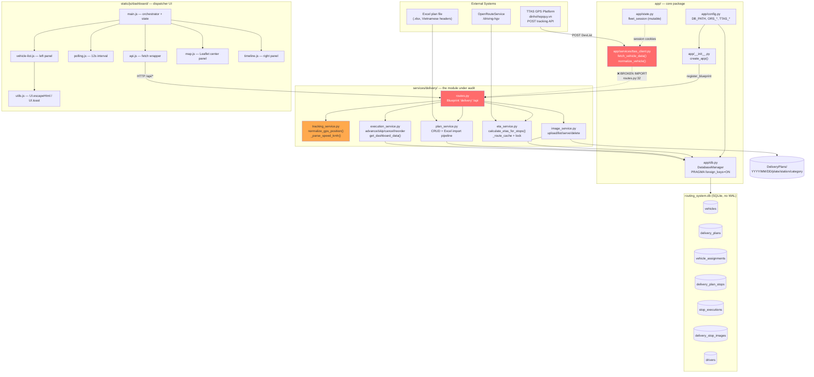
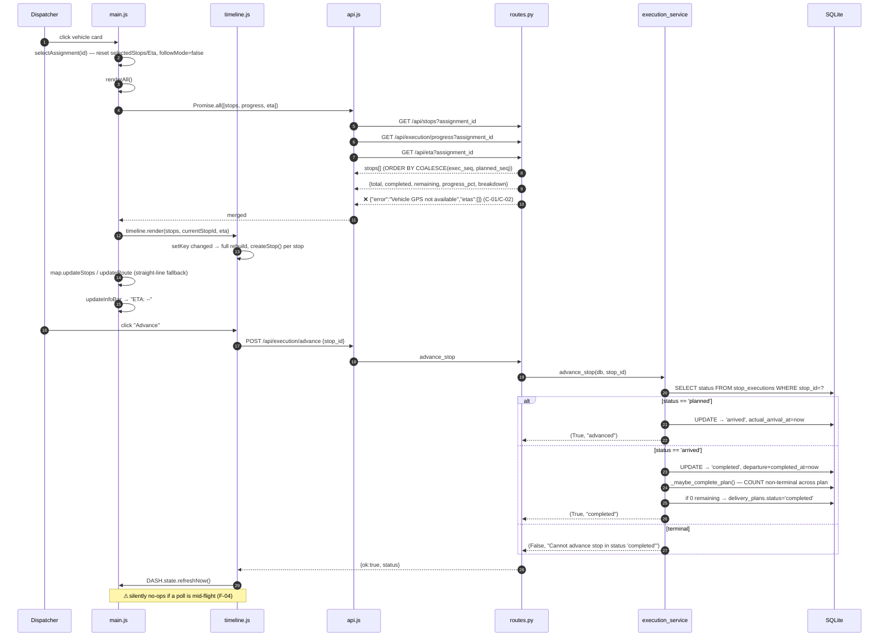
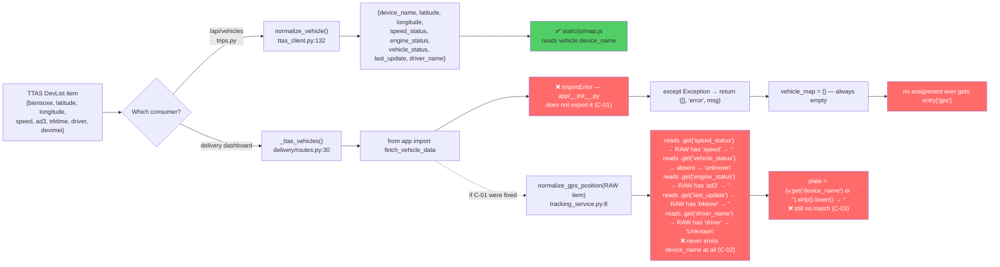
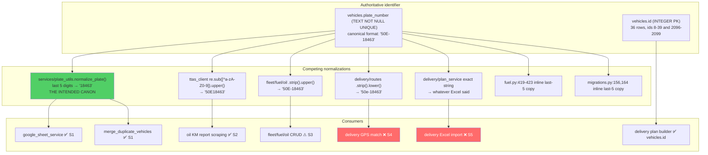
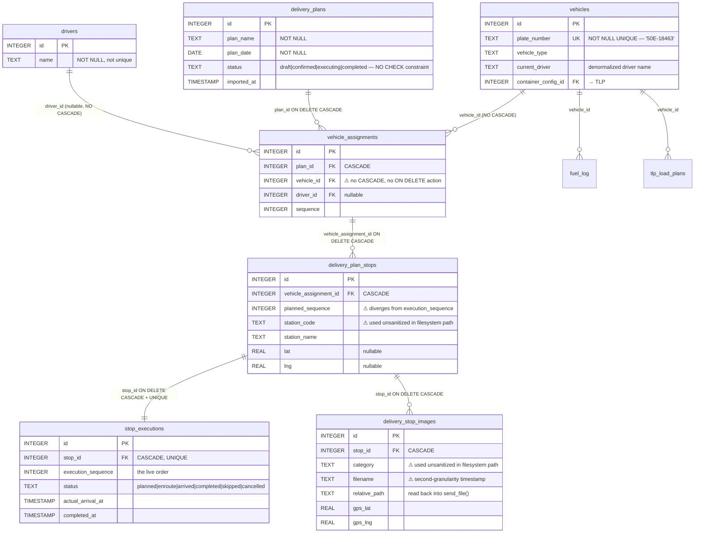
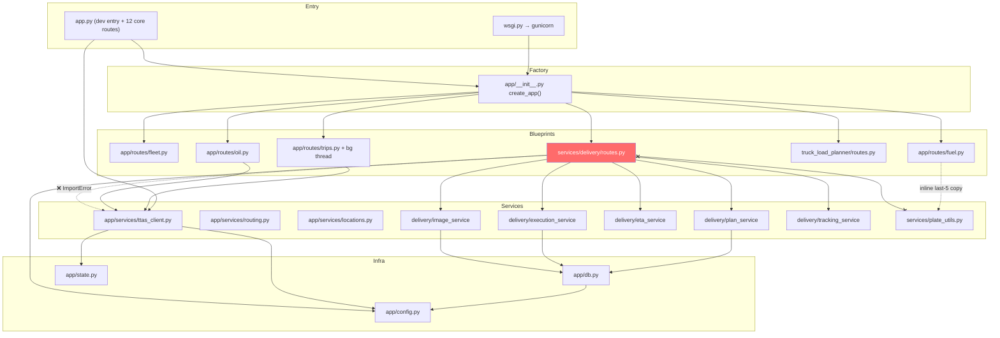
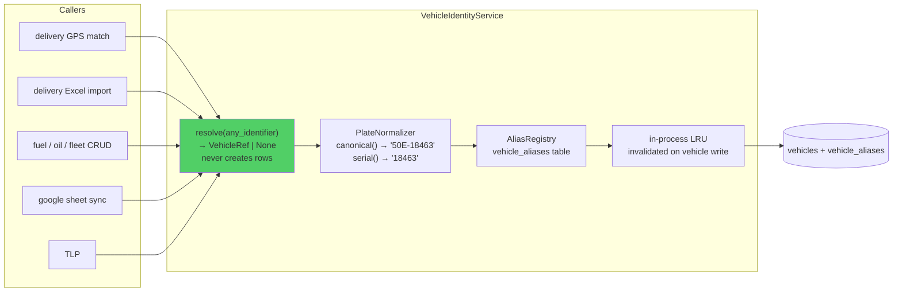
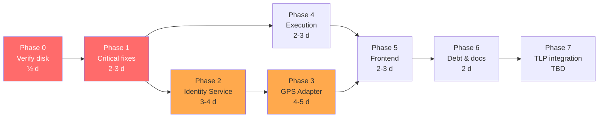

# Delivery / Dispatch Module — Architecture & Bug Audit

**Date:** 2026-07-31
**Scope:** `services/delivery/*`, `static/js/dashboard/*`, `templates/delivery-dashboard.html`,
delivery schema in `routing_system.db`, and every vehicle-identity path that feeds them.
**Status:** Investigation only at the time of writing. **No files were modified. No code was written.**

> **Remediation log.** Phases 1-3 have since been implemented — see the dated 2026-07-31
> entries in `docs/CHANGELOG.md` for what changed and why.
> Closed: C-01, C-02, C-03, C-04, C-05, C-07, C-08, C-09, L-03, L-06, S-02, S-03, S-04, S-05,
> T-12, plus the reorder-validation bug recorded below as C-06b.
> **Retracted: C-06 and F-01 — those findings were wrong.** Both are struck through in place
> with the evidence that disproves them, rather than deleted. Treat any remaining "Confirmed"
> label in this document as provisional until it has been re-verified by execution; several
> were asserted from reading alone, and at least two did not survive contact with a runtime.
>
> **Re-checked 2026-08-06.** No new closures. Two notes:
> - **L-07 (orphaned photo files) is still open**, verified by execution rather than by
>   reading: `grep -n unlink services/delivery/*.py` finds unlinks only in
>   `image_service.py`, `export_service.py` and a temp-file cleanup in `routes.py`.
>   `plan_service.delete_stop` / `delete_plan` / `delete_plans` / `clear_plans` still
>   rely on `ON DELETE CASCADE` for the rows and leave the files on disk. `DeliveryPlans/`
>   grows unbounded.
> - **Line references in this document are frozen at 2026-07-31** and the files have moved
>   substantially since (`routes.py` alone gained ~450 lines). Cited line numbers such as
>   `routes.py:358` are historical pointers — grep for the symbol, not the line.
> - **The "49 passing tests" in §1 is likewise a 2026-07-31 figure.** The delivery suites
>   are now 223 (service) + 135 (route); the route suite did not exist when this was
>   written, and building it was Phase 5 of the remediation.
>
> **Re-checked 2026-08-06b** (see `docs/AUDIT_2026-08-06.md`). Two findings resolve, both
> against evidence rather than reading:
> - **D-10 is CLOSED.** `render.yaml` now declares a 20 GB persistent disk
>   (`fleetfuel-data`) at `/var/data`, with `DB_PATH` and `DATA_DIR` pointed at it. The
>   database and the proof-of-delivery photos survive a redeploy. §8 of the priority table
>   and the "verify this first" instruction below are both discharged. `CLAUDE.md` carried
>   the stale claim until 2026-08-06 as well.
> - **D-09's reasoning is corrected, and it is still open.** WAL is still not configured,
>   but the harm was mis-stated. Measured: `database is locked` is a **writer-vs-writer**
>   failure and **WAL does not prevent it** — a held write lock does not block readers at
>   all. Delivery writes competing with `trips.py`'s refresh thread is real, but the
>   errors came from that thread holding a transaction across serial ORS calls, which was
>   a distinct bug and is now fixed. WAL remains worth enabling for throughput. See
>   `docs/CONCURRENCY_PLAN_2026-08-06.md`.
> - The delivery module itself needed **no changes** in the 2026-08-06 audit; all 135
>   route tests and 223 service tests still pass unmodified.
**Method:** graphify node/link extraction for the module map, then a full line-by-line read of
all 1,741 lines of `services/delivery/`, all 1,673 lines of `static/js/dashboard/`, plus
targeted reads of `app/services/ttas_client.py`, `app/db.py`, `app/__init__.py`, `app.py`,
`services/plate_utils.py`, `tests/test_delivery.py`, and live schema inspection of
`routing_system.db`.

---

## 1. Executive Summary

The Delivery module is **structurally well-built and functionally broken at its most important
seam.** The service layer is clean, tested (49 passing tests), and shows real care —
N+1 elimination via window functions, marker diffing instead of DOM rebuilds, an ORS route
cache with GPS-movement invalidation, deliberate `None`-vs-`0` speed semantics. That work is
genuine and should be preserved.

But **the GPS pipeline does not work at all, and has never worked.** Not "sometimes fails to
match a plate" — it fails before plate matching is ever reached. `services/delivery/routes.py:32`
imports `fetch_vehicle_data` from the `app` **package**, which does not export it. Every call
raises `ImportError`, is swallowed by a bare `except Exception`, and returns an empty vehicle
list with `source="error"`. Consequently:

- `/api/execution/dashboard` never attaches a `gps` key to any assignment.
- `/api/eta` always returns `{"error": "Vehicle GPS not available", "etas": []}`.
- No vehicle marker is ever created on the map, so **Zoom-to-vehicle, Follow, and Open-in-Google-Maps
  are permanently no-ops**.
- The entire "attention" system in `vehicle-list.js` (GPS-stale, reported-stopped) can never fire.
- Route polylines fall back to straight-lines-through-all-stops, forever.

Even if that import were fixed, **two more defects sit directly behind it**, each independently
sufficient to keep GPS broken (§3, Bugs C-02 and C-03). The plate-matching bug the team already
suspected is real, but it is the *fourth* problem in the chain, not the first.

This went undetected because **the route layer has zero test coverage.** All 49 tests import
service modules directly; none use a Flask test client. The one test that touches
`normalize_gps_position` feeds it hand-written dicts using the *output* schema of
`normalize_vehicle()`, which encodes the wrong contract and therefore cannot detect the mismatch.
The delivery tables in `routing_system.db` are all empty (0 plans, 0 assignments, 0 stops), which
is consistent with the module never having been exercised end-to-end against real data.

Beyond GPS, the audit confirmed **2 stored-XSS vectors**, **1 arbitrary-file-write path traversal**,
**a complete absence of authentication on destructive endpoints**, a **duplicate-vehicle-creation
path in Excel import** that recreates a failure mode the repo already has a cleanup script for,
and **a stop-reorder feature that never updates the UI**.

**Headline numbers:** 68 documented findings — 9 Confirmed bugs · 11 Likely bugs ·
9 frontend state/rendering findings · 11 schema findings · 8 performance bottlenecks ·
6 security findings · 14 technical-debt items · across 9 duplicate-logic clusters.
**Overall health: 4.4 / 10** — good bones, critical wiring faults.

### The five things that matter most

| # | Finding | Severity | Confidence |
|---|---|---|---|
| 1 | `from app import fetch_vehicle_data` — wrong module, GPS pipeline dead (C-01) | Critical | Confirmed |
| 2 | `normalize_gps_position()` consumes the wrong dict schema; drops `device_name` (C-02) | Critical | Confirmed |
| 3 | No auth on any endpoint; `POST /api/plans/clear` wipes all plans unauthenticated (S-01) | Critical | Confirmed |
| 4 | `confirm_import` creates duplicate vehicle rows on any plate-format variance (C-05) | Critical | Confirmed |
| 5 | Stored XSS via unescaped attribute interpolation in `map.js` / `timeline.js` (S-02) | High | Confirmed |

---

## 2. System Architecture Diagram



### Component responsibilities

| Component | Responsibility | Depends on | Owns state? |
|---|---|---|---|
| `app/services/ttas_client.py` | TTAS session lifecycle, live DevList fetch, raw→canonical vehicle normalization, report scraping | `app.state`, `app.config`, `main.get_session_cookies` | Yes — mutates `state.fleet_session` |
| `tracking_service.py` | Flatten a vehicle dict into dashboard telemetry; defensive km/h extraction | none (pure) | No |
| `execution_service.py` | Stop lifecycle state machine; plan auto-completion; reorder; temp-stop insert; dashboard aggregate | `app.db` | No |
| `plan_service.py` | Plan/assignment/stop CRUD; driver list merge; Excel parse→validate→preview→confirm | `app.db`, `openpyxl` | No |
| `eta_service.py` | Haversine + ORS leg routing, cumulative ETA, travelled-distance estimate | `requests`, ORS | **Yes — module-global `_route_cache`** |
| `image_service.py` | Proof-of-delivery photo storage on disk + DB row | `app.db`, filesystem | No |
| `routes.py` | HTTP surface (39 endpoints under `/api`); the *only* place TTAS + delivery meet | all five services above | No |
| `main.js` | Dashboard state container, filters, selection, orchestration of the other 5 FE modules | all FE modules | **Yes — `DASH.state`** |
| `polling.js` | 12s tick, re-entrancy guard, status pill | none | Yes — `timer`, `isPolling` |
| `map.js` | Leaflet markers/route, diffed updates | Leaflet, `DASH.state` | Yes — marker caches |
| `timeline.js` | Per-stop cards, Advance/Skip/Cancel, lazy photo gallery | `DASH.api`, `UI.toast` | Yes — `_stopNodes`, `openReasonStopIds` |
| `vehicle-list.js` | Left-panel cards, attention heuristics | `UI.escapeHtml` | Yes — `_cardNodes` |

### Architectural observations

- **`services/delivery/` is a top-level package, not under `app/`.** It reaches *up* into
  `app.db` and (attempts to reach) `app.services.ttas_client`, while `app/__init__.py` reaches
  *down* to import `services.delivery.routes`. This is a **bidirectional dependency between two
  top-level packages** — the deferred-import-inside-function style in `routes.py:32` and
  `app/__init__.py:49` is what keeps it from being a hard circular import at module load.
  It is also precisely what let bug C-01 hide: a deferred import inside a `try/except Exception`
  fails silently at request time instead of loudly at startup.
- **Two packages named `services`** — `app/services/` and top-level `services/` — already flagged
  in `CLAUDE.md`. This is not merely cosmetic: it is a plausible contributor to C-01, where a
  developer reaching for "the vehicle fetcher" imported from the wrong root.
- No service layer owns vehicle identity. Plate resolution is inlined at three different call
  sites in `routes.py` and `plan_service.py`, each with different semantics (§5).

---

## 3. Request Flow Diagram

### 3.1 Dashboard open → first paint

```mermaid
sequenceDiagram
    autonumber
    participant D as Dispatcher
    participant B as Browser (main.js)
    participant P as polling.js
    participant A as api.js
    participant R as routes.py
    participant E as execution_service
    participant DB as SQLite
    participant T as TTAS

    D->>B: GET /delivery/dashboard
    B->>B: init(): map.init(), bind filters/controls
    B->>A: loadPlans() → GET /api/plans
    A->>R: /api/plans
    R->>DB: SELECT * FROM delivery_plans
    DB-->>B: plans[] → populateFilterPlans()
    B->>P: polling.start(onPollTick)
    P->>P: tick() immediately, then setInterval 12s

    rect rgb(255,235,235)
    Note over P,T: Every 12 s
    P->>A: DASH.api.dashboard()
    A->>R: GET /api/execution/dashboard
    R->>E: get_dashboard_data(db)
    E->>DB: Q1 assignments JOIN plans/vehicles/drivers
    E->>DB: Q2 current stop per assignment (ROW_NUMBER window)
    E->>DB: Q3 status counts GROUP BY aid,status
    DB-->>E: 3 result sets, merged in Python
    E-->>R: assignments[] with current_stop + progress
    R->>R: _ttas_vehicles()
    R--xT: ❌ ImportError before any HTTP call (C-01)
    R-->>A: {assignments, gps_source:"error", gps_error:"cannot import name..."}
    end

    A-->>B: data
    B->>B: state.allAssignments = raw; applyFilters(); renderAll()
    B->>B: vehicleList.render() — cards, no GPS time, no attention dots
    B->>B: map.updateVehicles() — every entry skipped at `if (!gps)` → no markers
```

### 3.2 Select a vehicle → complete a stop



### Cache inventory

| Cache | Location | Key | Invalidation | Eviction | Problem |
|---|---|---|---|---|---|
| ORS route/ETA | `eta_service._route_cache` (module global, `threading.Lock`) | `assignment_id` | stop set/order/coords change, or GPS moved > 50 m | **none** | Unbounded growth; shared mutable list returned to callers (P-05) |
| Vehicle markers | `map.js vehicleMarkers` | `assignment_id` | diffed each poll; removed when not in `seen` | on removal | OK |
| Stop markers | `map.js stopMarkers` | `stop_id` | rebuilt when id-set key changes | on rebuild | Order changes are not detected (F-01) |
| Route polyline | `map.js lastRouteKey` | joined coord string | coord change | n/a | Module-global, not per-assignment |
| Timeline nodes | `timeline.js _stopNodes` | `stop_id` | rebuilt when id-set key changes | on rebuild | Order changes are not detected (F-01) |
| Photo gallery | closure in `bindPhotosToggle` | per stop node | never (once loaded) | with node | Newly uploaded photos never appear |
| TTAS session | `app.state.fleet_session` | n/a | `refresh_session()` on fetch failure | n/a | Shared across threads without a lock (B-06) |

---

## 4. GPS Flow Diagram



### The four-layer failure, in order

| Layer | File:line | What breaks | Would fixing only this help? |
|---|---|---|---|
| 1. Import | `routes.py:32` | `from app import fetch_vehicle_data` → `ImportError`, swallowed | No — exposes layer 2 |
| 2. Schema contract | `tracking_service.py:13-23` vs `ttas_client.py:132-167` | `normalize_gps_position` reads `normalize_vehicle`'s *output* keys from *raw* TTAS input | No — exposes layer 3 |
| 3. Missing field | `tracking_service.py:14-23` | output dict has no `device_name`; `routes.py:358,400` key on it | No — exposes layer 4 |
| 4. Plate format | `routes.py:358,363` | naive `.strip().lower()` on both sides; no normalization | This is the *only* layer the team had identified |

A fix that addresses only layer 4 (the suspected plate bug) changes nothing observable.

### Additional GPS-path defects

- **`routes.py:401` double-normalizes.** `normalize_gps_position(v)` is applied to `v`, which
  `_ttas_vehicles()` already normalized. On an already-normalized dict, `.get("latitude")` and
  `.get("longitude")` are absent (the keys are `lat`/`lng`) → `float(0)` → **the vehicle is
  placed at 0°N 0°E, the Gulf of Guinea.** Would surface immediately once C-01/C-02 are fixed.
- **`tracking_service.py:15-16` uses bare `float()`.** `app/utils/geo.py` provides `safe_float`
  for exactly this data, and `normalize_vehicle` uses it. Here a `None`, `""`, or comma-decimal
  latitude raises `ValueError` inside a list comprehension → the whole dashboard request 500s.
- **No GPS staleness gate.** `last_update` is passed through verbatim; a vehicle that stopped
  reporting three hours ago is rendered identically to a live one (the `gps_stale` heuristic in
  `vehicle-list.js:57` is the only guard, and it lives client-side).
- **No persistence.** GPS is fetched per-request and never stored. There is no
  `gps_positions` / breadcrumb table, so no history, no replay, and every dashboard poll is a
  synchronous TTAS round-trip in the request path.

---

## 5. Vehicle Identity Flow

This is the highest-priority section per the brief, and the finding is broader than expected:
**the codebase contains seven distinct plate-identity implementations, and the canonical one
already exists but is not used by the delivery module.**



### Complete identity call-site inventory

| # | File : line | Function | Input | Method | Output | Correct? |
|---|---|---|---|---|---|---|
| 1 | `services/plate_utils.py:13` | `normalize_plate` | any plate string | `re.sub("[^0-9]","")[-5:]` | `"18463"` | ✅ canonical |
| 2 | `app/services/ttas_client.py:143-150` | `normalize_vehicle` | raw DevList | 6-key fallback chain → `device_name` | `"50E-18463"` | ✅ tolerant |
| 3 | `app/services/ttas_client.py:192-198` | `_fetch_ttas_report_page` | plate + `<option>` text | alnum-strip + `.upper()`, compares text *and* value | match | ✅ |
| 4 | `app/services/ttas_client.py:245,256` | `_parse_ttas_report_html` | plate vs report header | alnum-strip + `.upper()` | bool | ✅ |
| 5 | `app/services/ttas_client.py:311,323` | `_parse_ttas_total_km` | same | same | bool | ✅ |
| 6 | `app/routes/fleet.py:57,126` | vehicle create/update | user JSON | `.strip().upper()` only | stored as-is | ⚠ hyphen not normalized |
| 7 | `app/routes/fuel.py:419-423` | `add_fuel_log` | 5-digit plate | inline last-5 scan over **all** vehicles | resolved plate + id | ⚠ duplicate of #1, O(n) per insert |
| 8 | `app/database/migrations.py:151-165` | `backfill_vehicles_from_fuel_log` | fuel_log plates | inline last-5 scan | suffix map | ⚠ duplicate of #1 |
| 9 | **`services/delivery/routes.py:358`** | `get_dashboard` | GPS dict | `.get("device_name").strip().lower()` | `""` **always** | ❌ **C-02/C-03** |
| 10 | **`services/delivery/routes.py:363`** | `get_dashboard` | `vehicles.plate_number` | `.strip().lower()` | `"50e-18463"` | ❌ **C-03** |
| 11 | **`services/delivery/routes.py:396,400`** | `get_eta` | assignment + GPS | same as 9/10 | no match **always** | ❌ **C-02/C-03** |
| 12 | **`services/delivery/plan_service.py:432-451`** | `confirm_import` | Excel `vehicle` column | **exact string equality**, else `INSERT INTO vehicles` | duplicate row | ❌ **C-05** |
| 13 | `services/delivery/plan_service.py:394` | `preview_import` | Excel `vehicle` column | `str().strip()` only | grouping key | ❌ **L-03** |
| 14 | `static/js/delivery-plan-builder.js:238,443,570` | plan builder | `vehicle_id` | integer FK lookup | vehicle object | ✅ correct approach |
| 15 | `static/js/dashboard/main.js:38` | vehicle filter | `plate_number` | `.toLowerCase().includes()` | substring match | ⚠ `"18463"` won't match `"50E-18463"`? It will (substring), but `"50E18463"` won't |

### Authoritative identifier — determination

**`vehicles.id` is authoritative.** It is the FK target for `vehicle_assignments.vehicle_id`,
`fuel_log.vehicle_id`, and `tlp_load_plans.vehicle_id`, and `plate_number` carries a
`UNIQUE` constraint that makes it a valid natural key *within* the DB.

**`vehicles.plate_number` in the format `50E-18463` is the authoritative external
representation.** All 36 live rows use uppercase-with-hyphen; `fuel_log.license_plate` matches.

**`normalize_plate()` (last 5 digits) is the intended cross-system join key** — its docstring
states Vietnamese plates' last 5 digits are the globally unique serial. The delivery module uses
neither.

### Documented mismatch scenarios

Given `vehicles.plate_number = '50E-18463'`:

| External input | `plate_utils` #1 | delivery GPS #10 | delivery import #12 | Result |
|---|---|---|---|---|
| `50E-18463` | `18463` | `50e-18463` | exact hit | ✅ works |
| `50E18463` | `18463` | `50e18463` | **miss → new vehicle row** | ❌ duplicate vehicle |
| `50E 18463` | `18463` | `50e 18463` | **miss → new vehicle row** | ❌ duplicate vehicle |
| `18463` | `18463` | `18463` | **miss → new vehicle row** | ❌ duplicate vehicle |
| `50e-18463` | `18463` | `50e-18463` | **miss → new vehicle row** | ❌ duplicate (case) |
| `50E-18463 ` (trailing space) | `18463` | `50e-18463` | hit (`.strip()`) | ✅ |
| `50E–18463` (en-dash) | `18463` | `50e–18463` | **miss → new vehicle row** | ❌ duplicate |

### Evidence this is not hypothetical

`tests/merge_duplicate_vehicles.py` exists specifically to clean up duplicate vehicle rows
created by the Google Sheet sync when it stored `09473` alongside `50H-09473`. Its module
docstring documents the exact failure mode. **`confirm_import` reintroduces that same failure
mode through a new door.**

Worse, that cleanup script is now **stale with respect to the delivery module**. Its FK
migration table (`tests/merge_duplicate_vehicles.py:58-70`) lists:

```python
INTEGER_FK_TABLES = [("fuel_log","vehicle_id"), ("tlp_load_plans","vehicle_id")]
TEXT_PLATE_TABLES = [("fuel_log","license_plate"), ("fuel_vehicle_profile","license_plate"),
                     ("oil_maintenance","license_plate"), ("oil_km_log","license_plate")]
```

**`vehicle_assignments` is absent.** Running the merge script once delivery data exists will
either abort on the `vehicles` DELETE (FK enforcement) or, if FKs are off, orphan every
assignment pointing at the merged-away duplicate.

---

## 6. Database Relationship Diagram



### Data flow through the tables

```
Excel (.xlsx)
  → parse_excel_rows()      header keyword matching → col_map
  → preview_import()        group by raw `vehicle` string → assignments preview
  → confirm_import()        vehicles lookup/INSERT → vehicle_assignments
                            → delivery_plan_stops (planned_sequence)
                            → stop_executions (execution_sequence = planned_sequence, 'planned')
                            → delivery_plans.status = 'confirmed'

runtime
  advance/skip/cancel       → stop_executions.status + timestamps
                            → _maybe_complete_plan → delivery_plans.status = 'completed'
  reorder_stops             → stop_executions.execution_sequence only
  insert_temp_stop          → new stop (planned_sequence = MAX+1)
                            + shift execution_sequence > after_sequence
                            + reopen plan if it had auto-completed
  upload_image              → file on disk + delivery_stop_images row

read
  get_dashboard_data        3 queries, merged in Python
  list_stops / get_plan     LEFT JOIN stop_executions, ORDER BY COALESCE(exec_seq, planned_seq)
```

### Schema findings

| ID | Finding | Severity | Confidence |
|---|---|---|---|
| D-01 | `vehicle_assignments.vehicle_id` has **no `ON DELETE` action**. With `PRAGMA foreign_keys=ON` (the `DatabaseManager` default), deleting a vehicle that has any assignment raises `FOREIGN KEY constraint failed` — an unhandled 500 in `app/routes/fleet.py`. Mirrors the exact hazard `CLAUDE.md` documents for `truck_load_planner`. | High | Confirmed |
| D-02 | **Duplicate index**: `idx_stop_executions_stop` (non-unique) and `idx_stop_executions_unique` (UNIQUE) are both on `stop_executions(stop_id)`. The non-unique one is fully redundant — pure write overhead. Verified present in the live DB. | Low | Confirmed |
| D-03 | No index on `delivery_plans.status`, yet `get_dashboard_data` filters `WHERE dp.status IN ('confirmed','executing')` on every 12s poll. | Medium | Confirmed |
| D-04 | No index on `stop_executions.status` or `(stop_id, status)`; the dashboard's window-function query filters on `e.status IN (...)`. | Medium | Confirmed |
| D-05 | No `CHECK` constraint on `delivery_plans.status` or `stop_executions.status`. `PUT /api/plans/<id>` accepts any string (`routes.py:88-93` → `update_plan(**data)`). A typo silently removes the plan from the dashboard; a crafted string reaches the DOM (see S-02). | High | Confirmed |
| D-06 | `planned_sequence` and `execution_sequence` diverge by design but nothing keeps them reconcilable. `insert_temp_stop` sets `planned_sequence = MAX+1` while `execution_sequence = after_sequence+1`. The UI shows `planned_sequence` (`timeline.js:372`, `map.js:58`) while ordering by `execution_sequence` — **an inserted stop displays a number inconsistent with its position**. | Medium | Confirmed |
| D-07 | `bulk_create_stops` defaults `planned_sequence` to `0` (`plan_service.py:287,302`). Multiple stops at sequence 0 make `ORDER BY execution_sequence` non-deterministic. | Medium | Confirmed |
| D-08 | `drivers.name` is not UNIQUE, and `list_drivers` merges real driver rows with synthetic `{"id": None}` entries derived from `vehicles.current_driver`. Selecting a synthetic driver cannot produce a `driver_id`, so the assignment silently keeps `driver_id = NULL`. | Medium | Likely |
| D-09 | No `PRAGMA journal_mode=WAL` (pre-existing, per `CLAUDE.md`). Every delivery write competes with `trips.py`'s background refresh thread on the same file. | Medium | Confirmed — **but the harm was mis-stated; WAL does not prevent `database is locked`. Corrected 2026-08-06, see `CONCURRENCY_PLAN_2026-08-06.md`** |
| D-10 | `render.yaml` has no `disk:` block. If no persistent disk is attached in the Render dashboard, **`routing_system.db` and every proof-of-delivery photo under `DeliveryPlans/` are destroyed on each redeploy.** | Critical | ~~Likely — verify in dashboard~~ **CLOSED 2026-08-06: a 20 GB disk at `/var/data` is declared; data persists** |
| D-11 | No table stores GPS history. Nothing can answer "where was 50E-18463 at 14:30 yesterday". | Medium | Confirmed |

---

## 7. Frontend Module Map

```mermaid
flowchart TB
    HTML["templates/delivery-dashboard.html<br/>load order: leaflet → utils → api →<br/>polling → vehicle-list → map → timeline → main"]

    UTIL["utils.js<br/>UI.escapeHtml ✅ escapes &lt; &gt; &amp; \" '<br/>UI.toast, ApiClient"]

    MAIN["main.js (481 L)<br/>DASH.state — single source of truth<br/>applyFilters · selectAssignment<br/>onPollTick · renderAll · updateInfoBar<br/>⚠ private escapeHtml (no quote escaping)"]

    API["api.js (87 L)<br/>13 endpoint wrappers<br/>⚠ no timeout / AbortController"]
    POLL["polling.js (61 L)<br/>12 000 ms · isPolling re-entrancy guard<br/>⚠ no visibilitychange, no finally"]

    VL["vehicle-list.js (287 L)<br/>diffed cards · setText · attention heuristics<br/>✅ uses UI.escapeHtml"]
    MAP["map.js (317 L)<br/>Leaflet · marker diffing · ORS polyline<br/>❌ private escapeHtml used in title= attr"]
    TL["timeline.js (441 L)<br/>stop cards · action delegation · reason rows<br/>lazy photo gallery<br/>❌ private escapeHtml used in title=/alt= attrs"]

    HTML --> UTIL --> API & POLL & VL & MAP & TL & MAIN
    MAIN -->|"reads/writes DASH.state"| VL & MAP & TL
    MAIN --> API
    MAIN --> POLL
    POLL -->|"onTick callback"| MAIN
    TL -->|"DASH.state.refreshNow()"| MAIN
    TL --> API
    VL -->|"DASH.state.selectAssignment()"| MAIN
    MAP -->|"DASH.state.selectAssignment()"| MAIN

    style MAP fill:#ff6b6b,color:#fff
    style TL fill:#ff6b6b,color:#fff
    style VL fill:#51cf66
    style UTIL fill:#51cf66
```

**State model.** A single `DASH.state` object in `main.js` holds plans, assignments (raw +
filtered), the selected assignment's stops/detail/ETA, follow mode, and filters. Every module
reads it directly; only `main.js` writes it. That is a sound design. The weaknesses are all in
*how* it is updated: no request-generation guard (F-05), no per-assignment scoping of module-global
caches, and full re-fetch of assignment detail on every tick.

**Update frequency.** One `GET /api/execution/dashboard` every 12 s, plus — whenever an assignment
is selected — three more requests (`/api/stops`, `/api/execution/progress`, `/api/eta`) on the
*same* tick. With ORS enabled and 15 remaining stops, `/api/eta` alone issues 15 serial HTTP calls
at up to 30 s timeout each.

**Positive findings.** `vehicle-list.js` and `map.js`'s `updateVehicles`, and `timeline.js`'s
`_patchStop`, all diff rather than rebuild, preserving scroll position, hover state, open popups,
and event bindings. `timeline.js`'s replacement of blocking `prompt()`/`alert()` with an inline
reason row guarded by `openReasonStopIds` is exactly the right instinct for a dispatch UI. These
directly satisfy the Operational UI Principles in `CLAUDE.md`.

---

## 8. Backend Dependency Map



**Layering violations:**

- `app/__init__.py:49` (core package) imports from top-level `services/` — a downward dependency
  from infrastructure into a feature package.
- `services/delivery/routes.py:32` imports from `app` — an upward dependency back into core.
- The two together form a package-level cycle broken only by deferred function-scoped imports.
- `services/delivery/` does not import `services/plate_utils.py` at all, despite being the module
  most in need of it.

---

## 9. Confirmed Bugs

Every item below was verified against source. Line numbers are exact.

---

### C-01 · GPS pipeline dead — wrong import module

- **Severity:** Critical **Confidence:** Confirmed
- **Evidence:** `services/delivery/routes.py:30-36`
  ```python
  def _ttas_vehicles():
      try:
          from app import fetch_vehicle_data          # ← the app PACKAGE
          raw, source, err = fetch_vehicle_data()
          return [tracking_service.normalize_gps_position(v) for v in raw], source, err
      except Exception as e:
          return [], "error", str(e)
  ```
  `fetch_vehicle_data` is defined only at `app/services/ttas_client.py:124`. Verified
  programmatically that the string `fetch_vehicle_data` does not appear anywhere in
  `app/__init__.py`, and that module defines no `__getattr__` and performs no star-import.
  Every other consumer imports it correctly: `app.py:12` and `app/routes/trips.py:18` both use
  `from app.services.ttas_client import fetch_vehicle_data`.
  Per `CLAUDE.md`, `import app` always resolves to the package, never to `app.py` — so the name
  bound in `app.py`'s own namespace is unreachable from here.
- **Root cause:** Two packages named `services` plus an `app.py`/`app/` name collision; the
  deferred import inside a bare `except Exception` converts a startup-time `ImportError` into a
  silent per-request degradation.
- **Execution path:** `GET /api/execution/dashboard` → `routes.py:355 _ttas_vehicles()` →
  `ImportError` → `except` → `([], "error", msg)` → `vehicle_map = {}` (`routes.py:356-360`) →
  loop at `362-365` matches nothing → no `entry["gps"]` → `map.js:95 if (!gps) return` → no marker.
- **User impact:** Dispatchers see a live-looking dashboard with a green "Live" status pill and
  **no vehicle positions at all**. Zoom-to-vehicle, Follow, and Open-in-Google-Maps are silent
  no-ops (`map.js:274-309` all early-return on missing `vehicleMarkers[id]`). All ETAs read `--`.
  GPS-staleness and reported-stopped alerts can never fire (`vehicle-list.js:52-64`).
- **Frequency:** 100% of requests, since the module was written.
- **Related occurrences:** `routes.py:394` (`get_eta`) uses the same helper — same failure.
  The bare `except Exception` swallow-and-degrade pattern also appears at `routes.py:142`,
  `routes.py:159`, `main.js:151`, `main.js:272`.

---

### C-02 · `normalize_gps_position` consumes the wrong dict schema

- **Severity:** Critical **Confidence:** Confirmed
- **Evidence:** `services/delivery/tracking_service.py:13-23` reads `speed_status`,
  `vehicle_status`, `engine_status`, `last_update`, `driver_name` — these are the **output** keys
  of `normalize_vehicle()` (`ttas_client.py:152-167`). But `_ttas_vehicles()` feeds it the **raw**
  TTAS DevList item, whose keys are `speed`, `ad3`, `trktime`, `driver`, `biensoxe`, `devimei`.

  | Output field | Reads key | Raw TTAS key | Result on raw input |
  |---|---|---|---|
  | `lat` / `lng` | `latitude` / `longitude` | `latitude` / `longitude` | ✅ only fields that survive |
  | `speed` | `speed_status` | `speed` | `""` always |
  | `speed_kmh` | derived | — | `None` always |
  | `vehicle_status` | `vehicle_status` | *(derived by `normalize_vehicle`)* | `"unknown"` always |
  | `engine_status` | `engine_status` | `ad3` | `""` always |
  | `last_update` | `last_update` | `trktime` | `""` always |
  | `driver_name` | `driver_name` | `driver` | `"Unknown"` always |
  | `device_name` | **not emitted** | `biensoxe` | **absent** |

- **Root cause:** No shared type/contract between the two normalizers; the function's own docstring
  names the parameter `raw_vehicle`, cementing the wrong assumption.
- **User impact:** Even after C-01 is fixed, the dashboard shows every vehicle as status "unknown",
  driver "Unknown", speed blank, GPS timestamp blank — and still cannot match any plate.
- **Frequency:** 100%.
- **Related:** `routes.py:401` calls `normalize_gps_position(v)` on an **already-normalized** `v`.
  On that input `.get("latitude")` is absent → `float(0)` → **vehicle plotted at 0°N 0°E**.
- **Aggravating factor:** `tests/test_delivery.py:228-260` (5 tests) feed `normalize_gps_position`
  hand-written dicts using `speed_status`/`vehicle_status`. **The tests validate the wrong
  contract**, so they pass while production is broken, and they will keep passing after any fix
  that changes the input schema.

---

### C-03 · Plate matching uses `.lower()` against a field that is always absent

- **Severity:** Critical **Confidence:** Confirmed
- **Evidence:** `services/delivery/routes.py:356-365` and `396-402`
  ```python
  plate = (v.get("device_name") or "").strip().lower()   # always ""  (C-02)
  ...
  plate = (entry.get("plate_number") or "").strip().lower()   # "50e-18463"
  ```
  Guarded by `if plate:` at line 359, so the empty GPS-side key means `vehicle_map` stays empty.
- **Root cause:** No normalization layer; raw string comparison with no tolerance for hyphen,
  space, or case variance.
- **User impact:** Once C-01 and C-02 are fixed, this becomes the active failure: any TTAS plate
  formatted as `50E18463` or `50E 18463` while the DB holds `50E-18463` silently produces no match.
  The dispatcher sees some vehicles on the map and some not, with no error and no explanation.
- **Frequency:** Depends on TTAS format consistency — unverifiable without live credentials, which
  this audit deliberately did not read.
- **Related:** `services/plate_utils.normalize_plate()` solves exactly this and is used correctly
  by `google_sheet_service.py` (5 call sites) and `merge_duplicate_vehicles.py`. Delivery does not
  import it. Note also that delivery uses `.lower()` while `fleet.py`, `fuel.py`, and `oil.py` all
  use `.upper()` — the module is inconsistent with the rest of the codebase.

---

### C-04 · No authentication on any delivery endpoint

- **Severity:** Critical **Confidence:** Confirmed
- **Evidence:** A grep for `login_required`, `@auth`, and `session[` across `app/`, `services/`,
  and `app.py` returns **zero matches**. All 39 delivery routes are open. The most severe:
  ```python
  @bp.route("/plans/clear", methods=["POST"])     # routes.py:114-117
  def clear_plans():
      plan_service.clear_plans(_db())             # DELETE FROM delivery_plans
      return jsonify({"ok": True})
  ```
  With `ON DELETE CASCADE` this destroys every plan, assignment, stop, execution record, and image
  row in the database. The only guard is a client-side `confirm()` (`main.js:434`).
- **Root cause:** Never implemented; no CSRF protection either.
- **User impact:** Anyone who can reach the host — the app binds `0.0.0.0` by default
  (`config.py:FLASK_HOST`) and is deployed publicly on Render — can wipe all delivery data with a
  single unauthenticated `curl -X POST /api/plans/clear`.
- **Frequency:** Continuous exposure.
- **Related:** `POST /api/plans/batch-delete`, `DELETE /api/plans/<id>`, `DELETE /api/stops/<id>`,
  `DELETE /api/assignments/<id>`, `DELETE /api/images/<id>`, and every mutating endpoint in the
  fleet/fuel/oil/trips/TLP blueprints share this exposure.

---

### C-05 · Excel import creates duplicate vehicle rows

- **Severity:** Critical **Confidence:** Confirmed
- **Evidence:** `services/delivery/plan_service.py:432-451`
  ```python
  c.execute("SELECT id, plate_number FROM vehicles")
  vehicles_map = {r["plate_number"]: r["id"] for r in c.fetchall()}   # exact-string key
  ...
  vehicle_id = vehicles_map.get(vehicle_key)      # vehicle_key = str(row["vehicle"]).strip()
  if not vehicle_id:
      c.execute("INSERT INTO vehicles (plate_number) VALUES (?)", (vehicle_key,))
      vehicle_id = c.lastrowid
  ```
  No case folding, no separator stripping, no `normalize_plate()`. On any mismatch it **silently
  creates a new vehicle** rather than failing or asking.
- **Root cause:** Same as C-03 — absent identity resolution — but with a write side-effect that
  corrupts the master vehicle table.
- **User impact:** A dispatcher imports a plan where the Excel says `50E18463`. A 37th vehicle
  appears in the fleet. It has no `vehicle_type`, no `current_driver`, and no GPS association. It
  pollutes `/api/fleet/vehicles`, the plan builder's autocomplete, the TLP vehicle picker, and
  fuel/oil reporting. The delivery assignment attaches to the phantom vehicle, so it can never
  match GPS even after C-01–C-03 are fixed.
- **Frequency:** Every import row whose plate format differs from the DB, permanently.
- **Related — this has already happened once:** `tests/merge_duplicate_vehicles.py` exists solely
  to clean up duplicates created by the Google Sheet sync for the identical reason (its docstring:
  *"Previous syncs created separate vehicle records for each format, resulting in duplicates"*).
  That script's FK-migration list (lines 58-70) **omits `vehicle_assignments`**, so it can no
  longer safely clean up after the delivery module.

---

### ~~C-06 · Stop reordering never updates the UI~~ — **RETRACTED 2026-07-31**

> **This finding was wrong.** Retained rather than deleted, because a retraction is more
> useful to the next reader than a silent edit.
>
> **The claim:** that `timeline.js:324` and `map.js:164` key their rebuild on
> `list.map(s => s.id).join(',')`, which "encodes set membership, not order", so a reorder
> produces the same key and the UI never rebuilds.
>
> **Why it's wrong:** `Array.prototype.join` preserves order. `[10,11,12].join(',')` is
> `"10,11,12"` while `[11,10,12].join(',')` is `"11,10,12"` — **different strings**. The key is
> order-sensitive, a reorder does change it, and both renderers do rebuild. Verified twice:
> directly in Node against the exact expression, and end-to-end through `list_stops()`, which
> returns `[3,2,1]` after reordering `[1,2,3]` (it orders by `execution_sequence`, which
> `reorder_stops` updates).
>
> **Second problem with it:** no frontend code calls `POST /api/stops/reorder` at all. The only
> match for "reorder" in `static/js/` is a drag handle in the plan *builder*, which reorders
> stops locally before a plan is saved and never touches the execution reorder endpoint. The
> dashboard has no reorder UI, so the scenario could not arise regardless.
>
> **Root cause of the error:** the "set key" naming in the surrounding source comments was taken
> at face value instead of being checked against what `join` actually does. Severity and
> confidence were both asserted without executing anything.
>
> **What was real, in the same function** — and is what the Phase 3 work actually fixed:
> `reorder_stops` validated nothing. A partial list renumbered only the stops it named,
> leaving `execution_sequence` values of `[1, 1, 2]` — no UNIQUE constraint prevents that, so
> `ORDER BY execution_sequence LIMIT 1` in `get_current_stop` became non-deterministic and the
> dashboard could show the wrong next stop. Stop ids from a *different* assignment matched no
> row yet the function still returned success, so a caller got a silent no-op. Both confirmed by
> execution; see the 2026-07-31 Phase 3 entry in `docs/CHANGELOG.md`.

---

### C-07 · Double-click on "Advance" skips the "arrived" state

- **Severity:** High **Confidence:** Confirmed
- **Evidence:** `timeline.js:72` renders `<button data-action="advance">` with no `disabled`
  handling; `handleStopAction` (`timeline.js:129-144`) fires the request and never disables the
  button. Server-side, `execution_service.advance_stop` (`:90-116`) does
  `SELECT status` → branch → `UPDATE` with **no atomicity and no idempotency token**.
  Two rapid POSTs: the first moves `planned → arrived`; the second, arriving after the first
  commits, sees `arrived` and moves it to `completed`.
- **Root cause:** A two-step state machine driven by a non-idempotent endpoint with no client-side
  debounce and no server-side guard.
- **User impact:** One accidental double-click marks a stop delivered without an arrival record.
  `actual_arrival_at` and `actual_departure_at` are written within the same second, destroying
  dwell-time data. If it was the last stop, `_maybe_complete_plan` fires and the plan leaves the
  dashboard's active view entirely.
- **Frequency:** Whenever a dispatcher double-clicks — routine on a touch device, and the module
  is explicitly mobile-targeted per `CLAUDE.md`.
- **Related:** The Skip/Cancel flow is protected by the inline reason row, so this affects Advance
  specifically. `insert_temp_stop` and `reorder_stops` are likewise non-idempotent.

---

### C-08 · Image upload filename collision destroys evidence

- **Severity:** High **Confidence:** Confirmed
- **Evidence:** `image_service.py:56`
  ```python
  filename = f"{int(datetime.now().timestamp())}{ext}"
  ```
  Second granularity, no stop id, no UUID, no collision check. `ensure_folder()` (`:20`) buckets
  by `year/month/day/plate/station_code/category`, so two photos of the **same stop, same
  category, same second** land on the identical path. `file_storage.save()` (`:59`) silently
  overwrites.
- **Root cause:** Timestamp used as a uniqueness token at a resolution coarser than the event rate.
- **User impact:** Two DB rows in `delivery_stop_images` point at one file. The dispatcher sees two
  thumbnails rendering the same image. **Proof-of-delivery evidence is silently lost** — the
  failure is invisible because both rows exist and both links resolve.
- **Frequency:** Any multi-select upload, or a driver tapping the shutter twice. On a mobile client
  posting a batch, near-certain.
- **Related:** `routes.py:136` uses a **fixed** temp path for Excel import
  (`_import_temp.xlsx`) — the same class of bug with a worse blast radius (L-01).

---

### C-09 · Empty assignments report "1 remaining stop"

- **Severity:** Medium **Confidence:** Confirmed
- **Evidence:** `execution_service.py:299-306` (and identically at `:209-217` in
  `get_assignment_progress`)
  ```python
  total = sum(counts.values()) or 1          # 0 stops → total = 1
  completed = ...                            # 0
  "remaining": total - completed,             # → 1
  ```
  The `or 1` exists to avoid `ZeroDivisionError` in `progress_pct` but leaks into `total` and
  `remaining`.
- **Root cause:** Division guard applied to the wrong variable.
- **User impact:** An assignment created without stops (routine mid-planning) displays
  `Progress: 0/1` and `1 remaining` on the vehicle card (`vehicle-list.js:266`) and info bar
  (`main.js:189`). A dispatcher chases a stop that does not exist.
- **Frequency:** Every stopless assignment, on every poll.
- **Related:** Duplicated logic — the identical seven-line progress computation appears in both
  `get_assignment_progress` and `get_dashboard_data` (see §14).

---

## 10. Likely Bugs

Behaviour reasoned from source but not observed at runtime (no live TTAS/ORS credentials were used).

| ID | Finding | Sev | Conf | Evidence |
|---|---|---|---|---|
| **L-01** | **Excel import temp-file race.** `routes.py:136` writes every upload to the single fixed path `<root>/_import_temp.xlsx`, then `finally: unlink()`. Two concurrent imports: B overwrites A's file mid-parse, or B's `unlink` deletes the file A is reading → A parses B's data into A's plan, or 500s. | High | Likely | `routes.py:131-146` |
| **L-02** | **`confirm_import` bypasses all validation.** `POST /api/plans/import/save` (`routes.py:149-160`) accepts arbitrary `rows` JSON and calls `confirm_import` directly. `validate_import_rows` runs only in the *preview* path. Out-of-range lat/lng, non-numeric coords, and missing station identifiers are written straight to the DB. | High | Likely | `routes.py:157`, `plan_service.py:360-385` vs `:428` |
| **L-03** | **One truck imported as two assignments.** `preview_import` (`plan_service.py:394`) groups by the raw `vehicle` string. A file mixing `50E-18463` and `50E18463` yields two `vehicle_assignments` — the driver's stops are split across two dashboard rows. | High | Likely | `plan_service.py:392-397, 437-442` |
| **L-04** | **Excel header mis-mapping.** `parse_excel_rows` (`:323-346`) is an `if/elif` chain where the `station_name` branch matches `"name"` and `"tên"` **before** the `manager_name` branch is reached. A column headed `"Manager Name"` or `"Tên người quản lý"` is classified as `station_name`, overwriting the real one. `col_map[key] = i` also lets a later column silently clobber an earlier match. `"note"` is tested twice in the same condition (`:345`). | High | Likely | `plan_service.py:323-346` |
| **L-05** | **`.upper()` on `float()` — `enroute` is unreachable.** `get_current_stop` and the dashboard window query both accept `status IN ('planned','enroute','arrived')`, and `get_eta` filters `('planned','enroute')`, but **no code path ever writes `'enroute'`**. `advance_stop` goes `planned → arrived → completed` directly. The status is dead schema surface that makes the state machine look richer than it is. | Medium | Confirmed | `execution_service.py:56,101-114,272`; `routes.py:392` |
| **L-06** | **Plan never confirmed on empty import.** In `confirm_import`, `UPDATE delivery_plans SET status='confirmed'` sits **inside** the per-vehicle loop (`plan_service.py:486-489`) — executed N times redundantly, and **zero times** if `vehicle_groups` is empty. The function still returns `True`, so the UI reports success while the plan stays `draft` and never appears on the dashboard. | Medium | Confirmed | `plan_service.py:444-489` |
| **L-07** | **Orphaned photo files.** `delete_stop`, `delete_plan`, `delete_plans`, and `clear_plans` rely on `ON DELETE CASCADE` to remove `delivery_stop_images` rows, but **nothing deletes the files under `DeliveryPlans/`**. Only `delete_image` (`image_service.py:98-112`) unlinks. Disk grows unbounded with unreferenced photos. | Medium | Confirmed | `plan_service.py:105-124, 268-273` |
| **L-08** | **Newly created plans never reach the filter dropdown.** `main.js:252` reloads plans only when `state.plans.length === 0`. A plan confirmed after page load is invisible in "All Plans" (and in the Manage Plans list, `:380`) until a manual reload. | Medium | Confirmed | `main.js:251-254, 268-275` |
| **L-09** | **Photo gallery caches "no photos" forever.** `bindPhotosToggle`'s `loaded` flag (`timeline.js:194-208`) is set on the first successful fetch, including the empty case. Photos uploaded afterwards never appear until the stop node is rebuilt. | Medium | Confirmed | `timeline.js:189-219` |
| **L-10** | **"ETA: 0 min" for unknown ETAs.** `main.js:192` computes `Math.round(eta.etas[0].eta_seconds / 60)` without a null check. `_compute_etas_for_stops` sets `eta_seconds: None` for stops missing coordinates (`eta_service.py:101-103`) → `Math.round(null/60) === 0` → the info bar reads **"ETA: 0 min"** where it should read "unknown". `timeline.js:417` guards this correctly with `typeof eta === 'number'`; `main.js` does not. | Medium | Confirmed | `main.js:191-194` vs `timeline.js:417` |
| **L-11** | **Broken Google Maps links.** `map.js:305-308` builds the directions URL from `stops.map(s => \`${s.lat},${s.lng}\`)` with no null filter and no completed-stop filter. Stops lacking coordinates produce `null,null` path segments; already-delivered stops are included in the route. | Medium | Confirmed | `map.js:301-309` |

### 10b. Frontend state & rendering findings

| ID | Finding | Sev | Conf | Evidence |
|---|---|---|---|---|
| ~~**F-01**~~ | ~~Set-based cache keys are order-blind.~~ **RETRACTED 2026-07-31** — `join(',')` preserves order, so these keys are order-sensitive and do trigger a rebuild. See the retraction under C-06 in §9. | ~~High~~ | **Wrong** | `timeline.js:325-335`, `map.js:164-166` |
| **F-02** | **Cross-container reason-row interference.** `openReasonStopIds` (`timeline.js:87`) is a single module-level `Set` shared by the per-stop timeline containers **and** the pinned current-stop card, both of which render Advance/Skip/Cancel for the same stop id. Opening a reason row in one suppresses content patching in the other (`:379`, `:434`). If the row is never confirmed or dismissed, that stop's detail block — **including its status badge** — is frozen indefinitely, so a change made by another dispatcher never appears. | Medium | Confirmed | `timeline.js:87, 379, 434` |
| **F-03** | **Ordering bug in reason-row cleanup.** `render()` clears `openReasonStopIds` only inside the `key !== _setKey` branch (`timeline.js:331`), but `_renderCurrentStopCard` runs *before* that at line 312 — so on a vehicle switch the pinned card is rendered while stale ids are still in the set. | Low | Confirmed | `timeline.js:312, 331` |
| **F-04** | **Post-action refresh silently dropped.** `handleStopAction` chains `.then(() => DASH.state.refreshNow())` (`timeline.js:142`), but `polling.refreshNow` returns immediately if `isPolling` is true (`polling.js:41`). Because a poll tick includes `/api/eta` — potentially many seconds of serial ORS calls (P-01) — clicking Advance mid-poll produces **no visible change for up to 12 more seconds**, with no feedback. Directly violates the Responsiveness principle in `CLAUDE.md`. | Medium | Confirmed | `timeline.js:141-144`, `polling.js:40-51` |
| **F-05** | **No request-generation guard.** `loadAssignmentDetail` (`main.js:121-154`) writes `state.selectedStops` / `selectedEta` unconditionally on resolve. A poll tick and a user selection can be in flight simultaneously; whichever resolves last wins, so a **slow response for the previously selected vehicle can overwrite the newly selected one's data**. No generation counter or `AbortController` exists. | Medium | Confirmed | `main.js:121-154, 257-264` |
| **F-06** | **`isPolling` not reset in a `finally`.** `polling.js:16-27` and `:40-51` set `isPolling = false` as the last statement rather than in a `finally`. Any throw from `setStatus` inside the `catch` leaves the flag latched true, **permanently killing all polling and manual refresh** with the status pill stuck on its last value. | Low | Confirmed | `polling.js:16-51` |
| **F-07** | **Double-firing filter handlers.** `bindFilterEvents` (`main.js:94-97`) attaches a `change` listener that re-dispatches an `input` event. For `<input>` elements — `filterDate`, `filterVehicle`, `filterDriver` — the browser fires `input` natively *and* again via `change`, so every filter edit runs `applyFilters() + renderAll()` twice. | Low | Confirmed | `main.js:80-99` |
| **F-08** | **Redundant attention computation.** `vehicle-list.js:147` builds `attentionByAssignment` for every assignment, then `_renderAttentionStrip` calls `computeAttention(a)` again at line 216 for each flagged entry, and the strip's `innerHTML` plus click listeners are rebuilt on every poll. | Low | Confirmed | `vehicle-list.js:146-230` |
| **F-09** | **Double-escaping into `textContent`.** `delivery-plan-builder.js:588` assigns `` `Stops for ${UI.escapeHtml(label)}` `` to `.textContent`. Escaping is unnecessary in a text-node assignment and renders entities literally — a plate containing `&` displays as `&amp;`. | Low | Confirmed | `delivery-plan-builder.js:588` |

---

## 11. Technical Debt

| ID | Item | Impact | Effort |
|---|---|---|---|
| T-01 | **Zero route-layer test coverage.** All 49 tests in `tests/test_delivery.py` import service modules directly; there is no Flask test client, no `services.delivery.routes` import, no HTTP-level test. This is why C-01 through C-05 survived. | Critical — the safety net has a hole exactly where the bugs are | M |
| T-02 | **Tests encode the wrong GPS contract.** `test_delivery.py:228-260` asserts against `speed_status`-keyed input. They pass today and will keep passing after any correct fix. | High — actively misleading | S |
| T-03 | **Two packages named `services`.** `app/services/` and `services/`. Already noted in `CLAUDE.md`; C-01 is a direct consequence. | High | L |
| T-04 | **Bidirectional package dependency** between `app/` and `services/delivery/`, held together by deferred function-scoped imports. | High | L |
| T-05 | **`services/plate_utils.py` unused by delivery** despite being the canonical, documented, tested normalizer. | High | S |
| T-06 | **Bare `except Exception` degradation** at `routes.py:35, 142, 159` and `main.js:151, 272` converts programming errors into silent empty results. C-01 hid here for the module's entire life. | High | S |
| T-07 | **Three private `escapeHtml` copies** (`main.js:469`, `map.js:20`, `timeline.js:9`) alongside the canonical `UI.escapeHtml` (`utils.js:60`) — which the same pages already load and `vehicle-list.js` already uses. The private copies are **not equivalent**: they use the `textNode.innerHTML` trick, which per the HTML serialization spec escapes only `&`, `<`, `>`, and NBSP — **not quotes**. See S-02. | High | S |
| T-08 | **`enroute` status is dead schema.** Referenced in four queries, written by none. | Medium | S |
| T-09 | **`planned_sequence` vs `execution_sequence` divergence** with no reconciliation and inconsistent display (D-06). | Medium | M |
| T-10 | **`_route_cache` is an unbounded module global** (`eta_service.py:13`). Never evicted; grows one entry per assignment for the process lifetime. Under multi-worker Gunicorn each worker keeps its own copy, so cache hit rate is `1/N`. | Medium | M |
| T-11 | **`app/routes/fuel.py:419-423` and `app/database/migrations.py:151-165`** each inline their own copy of `normalize_plate`'s last-5-digit logic. | Medium | S |
| T-12 | **`merge_duplicate_vehicles.py` is stale** — its FK table list omits `vehicle_assignments` (§5). | High | S |
| T-13 | **`DELIVERY_MODULE.md` "Known Limitations" is inaccurate.** Item 1 claims *"If TTAS is unreachable, ETA shows 'Vehicle GPS not available'. The dashboard gracefully handles this."* — this describes the module's permanent state, not a failure mode, and the phrasing has masked C-01 as expected behaviour. Item 4 claims the N+1 in `get_plan` is the only one; `get_dashboard_data` was since fixed but `get_plan` was not. | High | S |
| T-14 | **No CHANGELOG entry** will exist for these findings until remediation begins; `CLAUDE.md`'s Definition of Done requires dated entries for architecturally significant changes. | Low | S |

---

## 12. Performance Bottlenecks

| ID | Bottleneck | Evidence | Impact |
|---|---|---|---|
| **P-01** | **Serial ORS calls in the request path.** `_compute_etas_for_stops` (`eta_service.py:97-127`) loops stops and calls `calculate_eta` → `requests.get(..., timeout=30)` **one leg at a time**. 15 remaining stops = up to 15 sequential HTTP round-trips, worst case **450 s**, blocking a Gunicorn worker the entire time. | Critical |
| **P-02** | **Synchronous TTAS fetch on every dashboard poll.** `routes.py:355` calls `_ttas_vehicles()` inline. `fetch_live_vehicle_data` (`ttas_client.py:97-121`) retries `MAX_LIVE_FETCH_ATTEMPTS` times with `timeout=15` and `time.sleep(0.5)` between attempts — a worst case of ~31 s per poll, every 12 s, per open dashboard. (Currently masked by C-01, which makes it instant. Fixing C-01 **exposes** this.) | Critical |
| **P-03** | **`get_plan` N+1.** `plan_service.py:66-75` issues one stops query per assignment. 20 assignments = 22 queries. Documented as "acceptable" but it is the last remaining N+1 after `get_dashboard_data` was fixed. | Medium |
| **P-04** | **Full assignment-detail refetch every 12 s.** `main.js:257-264` re-issues `/api/stops`, `/api/execution/progress`, and `/api/eta` on every tick for the selected assignment, even when nothing changed. Combined with P-01 this is the dominant cost. | High |
| **P-05** | **Shared mutable cache result.** `calculate_etas_for_stops` (`eta_service.py:157`) returns the cached **list object itself**, not a copy. Any caller that mutates an element corrupts the cache for all subsequent requests across threads. | Medium |
| **P-06** | **O(n) plate scan per fuel-log insert.** `fuel.py:419-423` does `SELECT id, plate_number FROM vehicles` and loops in Python on every insert with a 5-digit plate. Should be an indexed lookup on a normalized column. | Low |
| **P-07** | **Missing indexes.** No index on `delivery_plans.status` (filtered every poll), `stop_executions.status`, or `delivery_plan_stops.planned_sequence`. Plus one fully redundant duplicate index on `stop_executions(stop_id)` (D-02). | Medium |
| **P-08** | **No polling backoff.** `polling.js` runs a fixed 12 s interval with no `visibilitychange` handling — hidden tabs keep hammering the server and TTAS indefinitely. `api.js` has no `AbortController`, so a slow `/api/eta` blocks the `isPolling` guard and freezes the dashboard while still showing "Live". | Medium |

---

## 13. Security Observations

| ID | Finding | Sev | Conf | Detail |
|---|---|---|---|---|
| **S-01** | **No authentication or CSRF protection, anywhere.** | Critical | Confirmed | See C-04. `POST /api/plans/clear` destroys all delivery data unauthenticated. `SECRET_KEY` also defaults to `"dev-secret-key-change-in-production"` (`config.py`) — mitigated in production only because `render.yaml` sets `generateValue: true`. |
| **S-02** | **Stored XSS via attribute-context interpolation.** | High | Confirmed | The private `escapeHtml` in `map.js:20` and `timeline.js:9` builds a text node and reads `.innerHTML`. Per the HTML fragment-serialization algorithm this escapes `&`, `<`, `>`, and NBSP — **it does not escape `"` or `'`**. The canonical `UI.escapeHtml` (`utils.js:60-63`) *does*. Three exploitable sinks:<br>• `map.js:184` — `title="${escapeHtml(s.station_name)}"`, and `station_name` is fully user-controlled via Excel import or `POST /api/stops`.<br>• `timeline.js:211` — `title="${escapeHtml(img.category)}"`, where `category` comes straight from `request.form.get("category","extra")` with no allowlist (`routes.py:444`).<br>• `timeline.js:212` — `alt="${escapeHtml(img.category)}"`.<br>Payload `" onmouseover=alert(document.cookie) x="` breaks out of the attribute. `CLAUDE.md` records that the 2026-07-29 refactor fixed exactly this class of bug ("older copies that missed single quotes") — **these three files were missed.** |
| **S-03** | **Stored XSS via unvalidated plan status.** | High | Confirmed | `main.js:395` interpolates `${statusClass}` — raw `p.status` — into **both** a `class` attribute and a text node with **no escaping at all**. `PUT /api/plans/<id>` (`routes.py:87-93`) passes arbitrary JSON to `update_plan(**data)`, whose allowlist permits `status` as any string, and `delivery_plans.status` has no `CHECK` constraint (D-05). End-to-end injection with no auth required. |
| **S-04** | **Path traversal → arbitrary file write inside the repo.** | High | Confirmed | `image_service.ensure_folder` (`:20`) builds `UPLOAD_ROOT / year / month / day / plate / station_code / category` from `station_code` (user-supplied via Excel or `POST /api/stops`) and `category` (user-supplied via the upload form), with **no sanitization**, then calls `folder.mkdir(parents=True, exist_ok=True)`. A `station_code` of `../../../static/js` writes an uploaded file into the served static directory. `relative_to(BASE_DIR)` at line 61 raises only if the path escapes the repo root entirely — **it does not prevent writing anywhere *inside* it**, including `static/`, `templates/`, and `app/`. |
| **S-05** | **Unrestricted upload type + unsafe serving.** | High | Confirmed | `ext = Path(original_name).suffix` (`image_service.py:55`) with no allowlist, no MIME check, no size limit, and no `secure_filename`. `serve_image` (`routes.py:463-471`) then `send_file()`s the stored path; Flask infers `Content-Type` from the extension, so an uploaded `.html` or `.svg` is served as `text/html` / `image/svg+xml` **from the application's own origin** — same-origin stored XSS with full session access. Same gap on the Excel import endpoint (`routes.py:135-137`): no extension check, no size cap. |
| **S-06** | **Information disclosure through error passthrough.** | Medium | Confirmed | `routes.py:143, 160` return `str(e)` to the client, and `get_dashboard` returns `gps_error` verbatim. Internal module paths, SQL fragments, and (via C-01) the internal package layout leak to any caller. `app.py:208` does the same for geocoding. |

**Reviewed and found sound:** all SQL uses `?` placeholders; the two dynamic `f"UPDATE ... SET {set_clause}"` statements (`plan_service.py:101,188,264`, `execution_service.py:83`) build column names exclusively from hard-coded `allowed` sets, never from user input — **no SQL injection was found**. `vehicle-list.js` and `delivery-plan-builder.js` use `UI.escapeHtml` correctly throughout. `.env` and `credentials.json` were not read at any point during this audit.

---

## 14. Duplicate Logic Inventory

| # | Duplicated logic | Locations | Canonical home | Divergent? |
|---|---|---|---|---|
| 1 | **Plate normalization** | `plate_utils.py:30` · `ttas_client.py:192,245,311` · `fleet.py:57,126` · `fuel.py:419-423` · `oil.py:146,175,204,220` · `migrations.py:156,164` · `delivery/routes.py:358,363,396,400` · `plan_service.py:394,435` | `services/plate_utils.py` | **Yes — 5 incompatible semantics** (last-5 / alnum-upper / strip-upper / strip-lower / exact) |
| 2 | **HTML escaping** | `utils.js:60` · `main.js:469` · `map.js:20` · `timeline.js:9` | `UI.escapeHtml` | **Yes — the 3 copies don't escape quotes → S-02** |
| 3 | **Haversine distance** | `app/utils/geo.py:8` · `eta_service.py:18` | `app/utils/geo.py` | No — byte-identical, pure duplication |
| 4 | **Speed km/h extraction** | `tracking_service.py:26` · `app/routes/trips.py` (per its own docstring) | none | Yes — one returns `None`, the other `0` (documented as deliberate) |
| 5 | **Progress computation** (`total`/`completed`/`remaining`/`progress_pct`/`breakdown`) | `execution_service.py:209-219` · `execution_service.py:298-307` | one helper | No — identical, incl. the C-09 `or 1` bug in both |
| 6 | **Stop-list SELECT with execution LEFT JOIN** | `plan_service.py:67-74` · `:204-211` · `:218-224` · `execution_service.py:50-59` · `:262-274` | one query builder | Slightly — `get_current_stop` uses `JOIN`, the others `LEFT JOIN`, giving different results for stops with no execution row |
| 7 | **`statusClass` / `statusLabel` status→CSS maps** | `vehicle-list.js:21-37` · `timeline.js:16-32` | `utils.js` | Yes — different fallbacks (`status-draft` vs `status-planned`) |
| 8 | **Excel vehicle grouping** | `plan_service.py:392-397` (`preview_import`) · `:437-442` (`confirm_import`) | one helper | No — identical, so a fix must be applied twice |
| 9 | **Refresh-now button binding** | `main.js:279` (`refreshNowBtn`) · `main.js:308` (`refreshGPSBtn`) | one handler | No — two buttons, same body |

---

## 15. Highest-Risk Areas

Ranked by (likelihood of harm) × (severity of harm) × (difficulty of detection).

| Rank | Area | Risk | Why |
|---|---|---|---|
| 1 | **`services/delivery/routes.py` lines 30-37, 352-371, 385-428** | Extreme | The entire GPS/ETA surface. Three confirmed Critical bugs (C-01, C-02, C-03), zero test coverage, and every failure is silent. |
| 2 | **`plan_service.confirm_import` (`:428-491`)** | Extreme | Writes to the master `vehicles` table with no identity resolution and no validation (C-05, L-02, L-06). Corruption is permanent and propagates to fuel, oil, and TLP. |
| 3 | **Auth / authorization (absent everywhere)** | Extreme | One unauthenticated request destroys all delivery data (C-04). No mitigating control exists. |
| 4 | **`image_service.py` + `/api/stops/<id>/images` + `/api/images/<id>/file`** | High | Path traversal (S-04), unrestricted upload + same-origin serving (S-05), silent evidence loss (C-08), orphaned files (L-07). Proof-of-delivery photos are the module's legal-evidence artifact. |
| 5 | **Frontend attribute-context escaping (`map.js`, `timeline.js`)** | High | Two confirmed stored-XSS sinks (S-02) plus a third via plan status (S-03), on a page with no auth and no CSP. |
| 6 | **`eta_service` synchronous ORS loop** | High | P-01 + P-02 will make the dashboard unusable the moment C-01 is fixed — a fix that *appears* to work in dev with one truck and collapses with 36. |
| 7 | **Stop lifecycle atomicity** | Medium-High | Non-idempotent `advance` (C-07), non-validating `reorder` (C-06), `planned`/`execution` sequence divergence (D-06). |
| 8 | **Deployment persistence** | Medium-High | If no Render disk is attached, everything above is moot — data vanishes on redeploy (D-10). **Verify this first; it is a 2-minute check.** |

---

## 16. Improvement Opportunities

Beyond bug fixes, ordered by value-to-effort.

1. **Emit `gps_source` / `gps_error` into the UI.** The dashboard already receives both fields
   (`routes.py:369-370`) and **displays neither**. Had the status pill shown "GPS: error" instead
   of a green "Live", C-01 would have been caught on day one. One badge, ~10 lines.
2. **Fail loudly on startup.** Move the TTAS import to module scope in `routes.py` so an
   `ImportError` aborts `create_app()` rather than degrading silently per request.
3. **Add a route-layer test suite** using `app.test_client()` — even 10 smoke tests asserting
   `gps_source == "live"` and that a known plate resolves would have caught C-01 through C-03.
4. **Persist GPS positions** to a `gps_positions` table (vehicle_id, lat, lng, recorded_at,
   speed_kmh, source). Unlocks history, replay, staleness detection, and decouples the dashboard
   from TTAS availability.
5. **Parallelize ORS legs** with a bounded `ThreadPoolExecutor`, or switch to the ORS
   *matrix*/*directions-with-waypoints* endpoint — one call instead of N.
6. **Server-Sent Events** in place of 12 s polling for the dashboard feed; the payload is small
   and one-directional.
7. **Status enums** as `CHECK` constraints plus a shared Python constant, closing D-05 and S-03
   at the source.
8. **A `stop_execution_events` audit table** (who advanced/skipped/cancelled what, when). An
   operations system used by multiple dispatchers with no accountability trail is a gap.
9. **Idempotency keys** on `advance` / `insert` / `reorder`, closing C-07.
10. **Content-Security-Policy header** as defence-in-depth for S-02/S-03/S-05.
11. **Consolidate `statusClass`/`statusLabel` and `escapeHtml` into `utils.js`**, deleting all
    private copies.
12. **Server-side pagination** on `/api/plans` — currently unbounded.

---

## 17. Future Architecture Proposal

### 17.1 Vehicle Identity Service — `services/vehicle_identity.py`

**The single highest-value change in this document.**



**Resolution order:** exact `plate_number` → canonical form → alias table → 5-digit serial →
`None`. Critically, `resolve()` **never inserts** — callers must handle `None` explicitly,
which structurally prevents C-05.

- **Benefits:** eliminates 5 of the 7 competing schemes; makes C-03 and C-05 unrepresentable;
  gives `merge_duplicate_vehicles.py` a real home; one place to add future formats.
- **Affected files:** new `services/vehicle_identity.py`; `services/plate_utils.py` folds into it;
  callers updated in `delivery/routes.py`, `delivery/plan_service.py`, `fuel.py`, `oil.py`,
  `fleet.py`, `migrations.py`, `google_sheet_service.py`.
- **Migration complexity:** Medium. New `vehicle_aliases` table (`vehicle_id`, `alias`,
  `source`, `created_at`) plus a one-time backfill from existing plates.
- **Risks:** touching fuel/oil plate handling risks regressing working reporting. **Mitigate by
  adopting it in delivery first** — delivery has 0 rows of production data, making it a zero-risk
  proving ground.

### 17.2 GPS Adapter — `services/gps/`

```
services/gps/
  ports.py       GpsPosition dataclass — the ONE contract
  ttas.py        TtasAdapter: raw DevList → GpsPosition (owns every TTAS key name)
  cache.py       TTL cache, refreshed by a background job, not per-request
  service.py     positions_by_vehicle() → dict[vehicle_id, GpsPosition]
```

A `GpsPosition` dataclass with an explicit `vehicle_ref` field makes C-02 a type error rather than
a silent empty string. `positions_by_vehicle()` returns a map keyed by **`vehicles.id`** — resolved
once via the Identity Service — so route handlers never touch plates at all.

- **Benefits:** kills C-01/C-02/C-03 as a class; removes the synchronous TTAS call from the request
  path (P-02); enables GPS persistence and history.
- **Affected files:** new package; `app/services/ttas_client.py` keeps session management and
  report scraping, sheds normalization; `services/delivery/tracking_service.py` is **deleted**
  (absorbed); `delivery/routes.py` GPS blocks replaced.
- **Migration complexity:** Medium. `normalize_vehicle`'s output shape must stay stable for
  `/api/vehicles`, `trips.py`, and `static/js/map.js`, so introduce the adapter alongside and
  migrate `/api/vehicles` last.
- **Risks:** Low for delivery (nothing works today). Medium if `normalize_vehicle` is changed —
  don't; wrap it.

### 17.3 Synchronization Layer — background GPS refresher

A single APScheduler job (or the `POST /api/refresh-routes` external-scheduler pattern already
documented in `app.py:216-223`) polls TTAS on a fixed cadence and writes to `gps_positions` +
cache. Requests read the cache only.

- **Benefits:** request latency becomes DB-bound; TTAS load is constant regardless of dispatcher
  count; GPS history for free.
- **Risks:** Under multi-worker Gunicorn each worker would spawn a duplicate job — the same hazard
  `app.py` already documents for the trips thread. Requires either `--workers=1 --threads=N` or an
  external scheduler. **Decide this explicitly; do not repeat the trips.py pattern by accident.**

### 17.4 Shared Vehicle Resolver (frontend)

A small `VehicleResolver` in `utils.js` giving all pages one plate-display and plate-match helper,
paired with moving `escapeHtml`, `statusClass`, and `statusLabel` into `UI`. Low effort, closes
duplicate-logic clusters 2 and 7 and security finding S-02.

### 17.5 Truck Load Planner ↔ Delivery Execution integration

TLP and Delivery today share only `vehicles.container_config_id`. They are one join away from being
genuinely useful together.

**Recommended integration — a `tlp_load_plans.assignment_id` FK (nullable, `ON DELETE SET NULL`):**

| Direction | Capability | Complexity |
|---|---|---|
| TLP → Delivery | Generate a load plan **per vehicle_assignment**, so packing respects the actual stop list | Medium |
| Delivery → TLP | Feed `delivery_plan_stops.planned_sequence` into TLP as an **unloading-order constraint** — LIFO packing so stop 1's cargo is at the door | High (touches `truck_load_planner/logistics/constraints.py::get_door_status`) |
| TLP → Dashboard | Show the current stop's cargo manifest in the timeline detail panel | Low |
| Delivery → TLP | On `advance_stop → completed`, mark that stop's items unloaded and recompute remaining weight/CoG | High |

**Recommendation: do the low-complexity direction first** (manifest in the timeline). It is
read-only, additive, and delivers immediate dispatcher value. **Defer the LIFO-constraint
integration** — `CLAUDE.md` designates `truck_load_planner/logistics/` as a single source of truth
that must not be forked, and the delivery module must be stabilized before it becomes an input to
the packing engine. Do not begin any TLP↔Delivery work until Phase 1 and 2 below are complete.

---

## 18. Phased Refactoring Roadmap

Each phase is independently shippable with its own acceptance criteria, per `CLAUDE.md`'s
Large Feature Workflow.

### Phase 0 — Verify deployment reality (½ day)
Confirm whether a persistent disk is attached in the Render dashboard (D-10). **If not, nothing
else matters** — fix that first.
*Acceptance:* documented answer in `docs/CHANGELOG.md`; if absent, `disk:` added to `render.yaml`.

### Phase 1 — Stop the bleeding (2-3 days)
C-01 · C-02 · C-03 · C-04 · S-02 · S-03 · S-04 · S-05.
Fix the import; make `normalize_gps_position` accept `normalize_vehicle` output (or take raw and
own the raw keys — pick one and document it); route all plate comparison through
`plate_utils.normalize_plate` as an interim measure; add auth to every mutating endpoint; replace
the three private `escapeHtml` copies with `UI.escapeHtml`; sanitize `station_code`/`category`
before any path use; add an upload extension allowlist and size cap.
*Acceptance:* a route-layer test asserts `gps_source == "live"` and that a seeded plate resolves;
`pytest tests/test_delivery.py -v` still passes 49/49; an XSS payload in `station_name` renders as
text; `POST /api/plans/clear` returns 401 unauthenticated.

### Phase 2 — Vehicle Identity Service (3-4 days)
§17.1. Introduce `services/vehicle_identity.py` + `vehicle_aliases`. Adopt in **delivery only**
(`confirm_import`, `preview_import`, GPS matching). Make `resolve()` never insert; make
`confirm_import` reject unresolvable plates with a clear error instead of creating rows.
Update `merge_duplicate_vehicles.py` to include `vehicle_assignments` (T-12).
*Acceptance:* new `tests/test_vehicle_identity.py` covers all seven format variants from §5;
importing an Excel file with mixed plate formats creates **one** assignment and **zero** new
vehicles.

### Phase 3 — GPS Adapter + Sync Layer (4-5 days)
§17.2 + §17.3 + P-01 + P-02. Extract `services/gps/`, add `gps_positions`, move TTAS polling to a
background job, parallelize or batch the ORS legs, bound and evict `_route_cache`.
*Acceptance:* `/api/execution/dashboard` p95 under 200 ms with 36 vehicles; `/api/eta` under 3 s
with 15 stops; TTAS is called at a fixed rate independent of dispatcher count.

### Phase 4 — Execution correctness (2-3 days)
C-06 · C-07 · C-09 · D-05 · D-06 · D-07 · L-02 · L-06.
Order-aware cache keys in `timeline.js`/`map.js`; idempotency on `advance`; fix the `or 1`
progress bug; add status `CHECK` constraints and server-side enum validation; validate `reorder`
covers the full stop set; run `confirm_import` through `validate_import_rows`; move the plan-status
UPDATE out of the loop.
*Acceptance:* `pytest tests/test_delivery.py -v` passes with new reorder/double-advance/empty-import
cases; reordering visibly updates the timeline.

### Phase 5 — Frontend hardening & performance (2-3 days)
P-04 · P-08 · F-04 · F-05 · L-08 · L-09 · L-10 · L-11 · duplicate clusters 2, 7, 9.
Request-generation guards; conditional detail refetch; `visibilitychange` backoff;
`AbortController` timeouts; shared status helpers.
*Acceptance:* manual dispatch checklist in `docs/DELIVERY_MODULE.md` passes; no full re-render on
an unchanged poll (verify via DOM mutation count).

### Phase 6 — Debt & documentation (2 days)
T-01 · T-02 · T-03 (scoped) · T-08 · T-13 · L-07 · D-02 · D-03 · D-04.
Route-layer test suite; correct the GPS contract tests; drop or implement `enroute`; photo-file
cleanup on cascade delete; index changes; rewrite `DELIVERY_MODULE.md` Known Limitations;
`CHANGELOG.md` entries throughout.

### Phase 7 — TLP integration (scope separately)
§17.5, read-only manifest direction only. **Do not start before Phase 4 completes.**

---

## 19. Recommended Implementation Order



**Hard sequencing constraints:**

- Phase 0 gates everything — persistence is prerequisite to all data work.
- Phase 1's C-01/C-02 fix **must not** ship without Phase 3's async work queued immediately
  behind it: restoring GPS also restores the synchronous TTAS + serial-ORS blocking (P-01, P-02),
  so a "successful" Phase 1 will make the dashboard *slower* under real load. Ship Phase 1 to a
  staging environment first.
- Phase 2 must precede Phase 3 — the GPS adapter keys on resolved `vehicle_id`.
- Phase 4 is independent of 2/3 and can run in parallel with a second developer.
- Phase 7 must not start before Phase 4.

---

## 20. Files Most Likely to Change

| File | Phases | Change scale | Risk |
|---|---|---|---|
| `services/delivery/routes.py` | 1, 2, 3, 4 | **Heavy** — GPS blocks rewritten, auth decorators, validation | High — 39 endpoints, 0 tests |
| `services/delivery/tracking_service.py` | 1, 3 | **Deleted or rewritten** (absorbed by GPS adapter) | Low — 43 lines, pure |
| `services/delivery/plan_service.py` | 2, 4 | **Heavy** — `confirm_import`, `preview_import`, `parse_excel_rows` | High — writes to `vehicles` |
| `services/delivery/eta_service.py` | 3 | Medium — parallelism, cache eviction, copy-on-return | Medium — well tested |
| `services/delivery/execution_service.py` | 4 | Medium — idempotency, progress fix, reorder validation | Medium — well tested |
| `services/delivery/image_service.py` | 1 | Medium — sanitization, allowlist, unique filenames, cascade cleanup | Medium |
| `static/js/dashboard/timeline.js` | 1, 4, 5 | Medium — escaping, order-aware keys, debounce | Medium — most complex FE file |
| `static/js/dashboard/map.js` | 1, 4, 5 | Medium — escaping, order-aware keys, Gmaps URL | Medium |
| `static/js/dashboard/main.js` | 1, 5 | Medium — escaping, XSS in manage-plans, request guards, plan reload | Medium |
| `static/js/dashboard/polling.js` | 5 | Small — visibility backoff, `finally` | Low |
| `static/js/dashboard/api.js` | 5 | Small — `AbortController` | Low |
| `static/js/utils.js` | 5 | Small — absorb `statusClass`/`statusLabel` | Medium — shared by all pages |
| **`services/vehicle_identity.py`** | 2 | **New** | — |
| **`services/gps/*.py`** | 3 | **New package** | — |
| `services/plate_utils.py` | 2 | Folded into identity service | Low |
| `app/services/ttas_client.py` | 3 | Medium — sheds normalization, keeps session + scraping | **High — shared by trips/oil/`/api/vehicles`** |
| `app/__init__.py` | 1, 3 | Small — import fix, scheduler registration | Medium |
| `services/delivery/database.py` | 4, 6 | Small — CHECK constraints, index changes | Low |
| `app/database/migrations.py` | 2, 4 | Medium — alias backfill, index migration | Medium |
| `tests/test_delivery.py` | 1, 2, 4, 6 | **Heavy** — route-layer suite, corrected GPS contract | — |
| `tests/merge_duplicate_vehicles.py` | 2 | Small — add `vehicle_assignments` | Low |
| `docs/DELIVERY_MODULE.md` | 6 | Medium — rewrite Known Limitations | — |
| `docs/CHANGELOG.md` | all | Append per phase | — |
| `render.yaml` | 0 | Small — `disk:` block | High if wrong |

---

## 21. Development Effort Estimate

Solo developer, familiar with the codebase, including testing and documentation.

| Phase | Optimistic | Realistic | Pessimistic |
|---|---|---|---|
| 0 — Verify deployment | 0.5 d | 0.5 d | 1 d |
| 1 — Critical fixes | 2 d | 3 d | 5 d |
| 2 — Vehicle Identity Service | 3 d | 4 d | 6 d |
| 3 — GPS Adapter + Sync | 4 d | 5 d | 8 d |
| 4 — Execution correctness | 2 d | 3 d | 4 d |
| 5 — Frontend hardening | 2 d | 3 d | 4 d |
| 6 — Debt & documentation | 1.5 d | 2 d | 3 d |
| **Subtotal (Phases 0-6)** | **15 d** | **20.5 d** | **31 d** |
| 7 — TLP integration (read-only) | 2 d | 3 d | 5 d |

**Realistic total: ~4 working weeks** for Phases 0-6, plus ~3 days for the first TLP integration
step. Phase 1 alone (~3 days) converts the module from non-functional to functional and closes
every Critical security finding — **that is where the return is concentrated.**

Estimate assumptions: no CI exists, so every phase includes manual `pytest` runs; the delivery
tables are empty, so Phases 1-4 carry **no data-migration risk** for delivery itself (Phase 2's
`vehicle_aliases` backfill touches 36 live vehicle rows and does need care).

---

## 22. Overall Health Score

| Dimension | Score | Assessment |
|---|---|---|
| **GPS** | **1 / 10** | Non-functional. Four stacked defects (C-01/C-02/C-03 + the `routes.py:401` double-normalization). No persistence, no staleness handling, no history. The only working part is that `lat`/`lng` key names happen to coincide with TTAS's. |
| **Dispatch (dashboard UX)** | **6 / 10** | Genuinely good bones — diffed rendering, preserved scroll/collapse/popup state, inline reason rows replacing blocking prompts, mobile-aware layout. Undermined by an empty map, silent refresh drops (F-04), stale plan filters (L-08), and reorder not rendering (C-06). |
| **Execution** | **6 / 10** | Clean state machine, correct plan auto-completion with a thoughtful reopen-on-temp-insert path, good test coverage. Loses points for non-idempotent `advance` (C-07), unvalidated `reorder` (C-06), the `or 1` progress bug (C-09), dead `enroute`, and sequence divergence. |
| **Database** | **6 / 10** | Sensible normalization, correct cascade chain, a `UNIQUE` index enforcing 1:1 stop↔execution, and a real N+1 fix using window functions. Loses points for the missing `ON DELETE` on `vehicle_id` (D-01), absent `CHECK` constraints (D-05), missing hot-path indexes (D-03/D-04), one redundant index (D-02), no WAL, and no GPS history. |
| **Frontend** | **6 / 10** | The strongest layer. Modular, diffed, state-preserving, and `vehicle-list.js` + `delivery-plan-builder.js` escape correctly. Dragged down by three divergent private `escapeHtml` copies producing two confirmed XSS sinks (S-02), a third XSS via plan status (S-03), and order-blind cache keys. |
| **Backend** | **4 / 10** | Service layer is clean, small, well-tested, and correctly parameterized. The route layer is the weak point: zero coverage, no auth, no input validation, silent exception swallowing, and the module's Critical bugs all live there. |
| **Architecture** | **5 / 10** | Clear service separation and single-responsibility modules — but a bidirectional `app/` ↔ `services/` dependency held together by deferred imports, two packages named `services`, no vehicle-identity ownership, and seven competing plate schemes. The structure is what allowed C-01 to exist and hide. |
| **Security** | **3 / 10** | No authentication or CSRF on 39 endpoints including a total-wipe. Two confirmed stored-XSS sinks plus a third vector, path traversal to arbitrary in-repo file write, unrestricted upload served from the app origin. Credit where due: **SQL injection was systematically searched for and not found** — every query is properly parameterized, including the dynamic `SET` clauses. |
| **Testing** | **4 / 10** | 49 tests is respectable for a solo project and service-layer coverage is real. But route-layer coverage is 0%, and the GPS tests encode the wrong contract — they provide false confidence precisely where the Critical bugs live. |

### **Overall: 4.4 / 10**

The gap between the service layer (7/10 work) and the route layer (2/10 work) is the defining
characteristic of this module. Somebody thought carefully about window functions, cache
invalidation thresholds, `None`-vs-`0` semantics, and DOM diffing — and then wired the whole thing
to the wrong module with a `try/except` around it.

**The good news is that the fix is cheap relative to the damage.** Phase 0 + Phase 1 is roughly
3.5 days and moves the score to an estimated **6.5/10** by making GPS work and closing every
Critical security hole. The delivery tables are empty, so there is no production data at risk and
no migration burden — this is the least expensive moment this refactor will ever have.

---

## Appendix A — Method & Confidence Notes

- **graphify** was used first as instructed. The CLI binary is not installed in this environment,
  so `graphify-out/graph.json` (1,947 nodes / 4,140 links, with a recorded `built_at_commit`) was queried
  directly to produce the delivery-scoped subgraph — 354 nodes across 11 files — which drove the
  file-selection order. `GRAPH_REPORT.md` was not needed.
- **Every "Confirmed" finding** cites an exact file and line verified by reading the source in this
  session. Where behaviour depends on data not present (TTAS's live plate format, Render's disk
  configuration), the finding is marked **Likely** and the required verification step is stated.
- **The application was not executed.** Flask is not installed in the analysis sandbox, so C-01 was
  verified statically: the string `fetch_vehicle_data` is absent from `app/__init__.py`, that
  module defines no `__getattr__` and performs no star-import, and `CLAUDE.md` documents that
  `import app` always resolves to the package. A 30-second runtime confirmation is nonetheless
  recommended before remediation: `curl localhost:5000/api/execution/dashboard | jq .gps_source`
  should return `"error"`.
- **Live schema and row counts** were read from `routing_system.db`: 36 vehicles (all plates in
  `50E-18463` form), 2 drivers, and **0 rows in every delivery table**.
- **No secrets were read.** `.env` and `credentials.json` were never opened, per `CLAUDE.md`.
- **No files were modified.** This document is the only artifact created.

## Appendix B — Finding Index

| ID | Title | Severity | Confidence | § |
|---|---|---|---|---|
| C-01 | GPS pipeline dead — wrong import module | Critical | Confirmed | 9 |
| C-02 | `normalize_gps_position` wrong dict schema | Critical | Confirmed | 9 |
| C-03 | Plate matching on an always-absent field | Critical | Confirmed | 9 |
| C-04 | No authentication on any endpoint | Critical | Confirmed | 9 |
| C-05 | Excel import creates duplicate vehicles | Critical | Confirmed | 9 |
| ~~C-06~~ | ~~Stop reordering never updates the UI~~ — **RETRACTED, finding was wrong** | — | **Wrong** | 9 |
| C-06b | `reorder_stops` accepts partial/foreign stop lists → duplicate `execution_sequence` | Medium | Confirmed | 9 |
| C-07 | Double-click Advance skips "arrived" | High | Confirmed | 9 |
| C-08 | Image filename collision destroys evidence | High | Confirmed | 9 |
| C-09 | Empty assignments report "1 remaining" | Medium | Confirmed | 9 |
| L-01 | Excel import temp-file race | High | Likely | 10 |
| L-02 | `confirm_import` bypasses validation | High | Likely | 10 |
| L-03 | One truck imported as two assignments | High | Likely | 10 |
| L-04 | Excel header mis-mapping | High | Likely | 10 |
| L-05 | `enroute` status unreachable | Medium | Confirmed | 10 |
| L-06 | Plan never confirmed on empty import | Medium | Confirmed | 10 |
| L-07 | Orphaned photo files on cascade delete | Medium | Confirmed | 10 |
| L-08 | New plans absent from filter dropdown | Medium | Confirmed | 10 |
| L-09 | Photo gallery caches "no photos" forever | Medium | Confirmed | 10 |
| L-10 | "ETA: 0 min" for unknown ETAs | Medium | Confirmed | 10 |
| L-11 | Broken Google Maps directions links | Medium | Confirmed | 10 |
| D-01…D-11 | Schema findings | Critical…Low | mixed | 6 |
| P-01…P-08 | Performance bottlenecks | Critical…Low | Confirmed | 12 |
| S-01…S-06 | Security findings | Critical…Medium | Confirmed | 13 |
| T-01…T-14 | Technical debt | Critical…Low | Confirmed | 11 |
| F-01…F-09 | Frontend state & rendering findings | High…Low | Confirmed | 10b |

**Totals:** 9 Confirmed bugs (C) · 11 Likely bugs (L) · 9 frontend findings (F) · 11 schema
findings (D) · 8 performance bottlenecks (P) · 6 security findings (S) · 14 debt items (T)
= **68 documented findings**, none speculative, all with file:line evidence.
